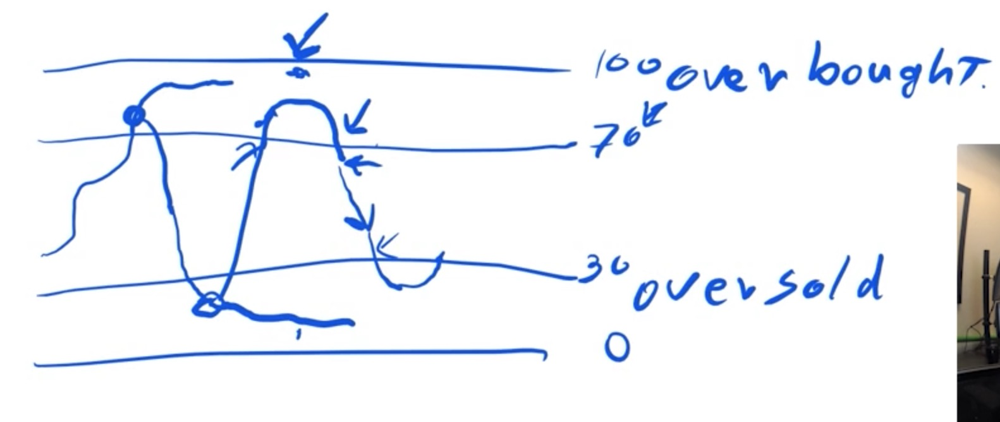
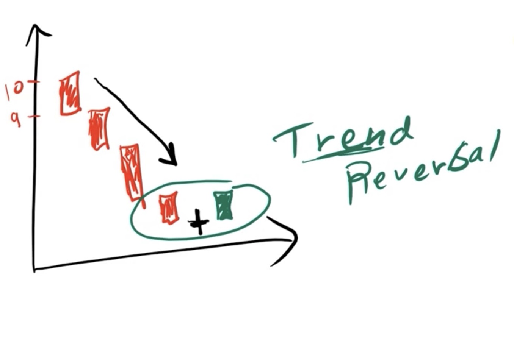
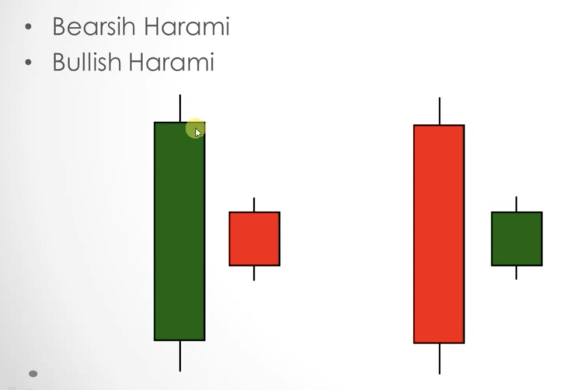
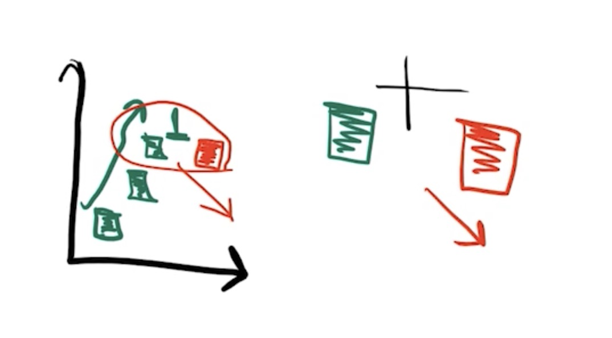

# Technical Analysis

## Types of Orders:
- **Market Order**: Buy/sell immediately
- **Limit Order**: Buy/sell at a limit price or better

**Shares Outstanding**: Amount of total shares issued.

**Float**: Amount of shares currently in the market.

**Bid**: (or bid price) Is the highest price that a buyer/bidder is willing to pay for a product = Best Price you can buy at.

**Ask**: (or ask price or offer) Is the lowest price that a seller is willing to receive for a product = Best price you can sell at.

**Spread:** Difference between Ask Price and Bid Price.

**Level 2**: 
- Order Book (entires consist of Buy/Sell orders)
- If a buyer offers more for the same stock than some other buyer, they will be put higher on the priority list. Vice versa for a seller.
  
**Level 1**: Best Ask/ Best Bid.

**Time of Sales**: Displays every single execution that happens on the market. The executions are displayed real time and include information like: time, direction, quantity traded and exchange traded on.

**Going Long**: Buying a stock and selling it back at a higher price.

**Going Short**: 
- Borrowing a stock that you do not own. Selling it. And if the price drops, buying it back at he lower price, giving back the stock to it’s original owner and keeping the difference of price (which is your profit). 
- Shorting is actually risky, because you have a chance of the stock not actually going down, and going to infinite, but the return is finite. 

**Being Flat**: Having no position in a particular stock. Sometimes it is good to not trade.

**Volume**: Volume drives the prices up or down. If the share prices increase or decrease without any significant change in volume, it will most likely swing back to the original price.

## Indicators:

**Bollinger Bands**: Gives you a range in which the stock price is most likely to fluctuate.
The concept of Bollinger bands is based on Standard Deviation. That's why, when the stock prices are not fluctuating, the bands narrow down and when the prices change suddenly, the band widens to accomodate for the standard deviation.
This strategy cannot be used always. We can only use it on **mean-reverting stocks**.

**[Relative Strength Indicator(RSI)](https://www.investopedia.com/terms/r/rsi.asp)**: If the indicator is closer to the 100% mark, then the stock is overbought and vice versa for oversold. Between the 30% and 70% is the sweet spot.

 When the stock crosses the 70% mark and is classified as overbought, the moment it crosses the 70% mark with the momentum reversed is when we should short the stock. A strategy like this won't work on a Biotech firm or any other firm which isn't a mean reversal firm. What that means is, a Biotech firm might drop a new patent, or get FDA approval which will increase the stock price.

**Average True Range(ATR)**: This indicator is a measure of how much a stock will go up or down. This helps predict the maximum profit you might make out of a buy/sell trade. Basically a measure of how much the price moves up/down over a period.

## Risk Management:

- **Risk Acceptance**: You are at a risk when you just hold stocks for a company. There is a chance that the company might go bankrupt, leading to a loss of all the investment.

- **Risk Avoidance**: By not participating in a trade, you are avoiding the risk to save on the losses.

- **Risk Limitation**: You can limit your losses by saying that if the stock goes below, say 20% of it's current price, I'm going to take the loss and get out.
**Stop Loss Order** can be set by checking out the resistance and support levels. So, we can put a stop loss below the support level, so that if the stock price plummets, out stop loss order is automatically issued and the stock is sold.

- **Risk Transferance** (Advanced topic)

## Money Management:

Logically, if you make a loss from a trade, it is much more difficult to get back to the earlier principal amount, because after the loss, the principal amount has reduced. **General rule of thumb**: Risk per position should not exceed 5%. Keep it around 2%.
**NOTE**: Stick to your rule of stop losses. If the stock price goes below the set stop loss, take the loss and sell it. Always stick to the rule you've set.

## Position Sizing:
This is a measure of how many stocks you should buy in any given trade, to minimize your losses if the price plummets.

**Simple Position Sizing**: 
position size = (Max loss per trade (as mentioned earlier, 2% of total capital))/ (amount you can lose per share (buy price - stop loss))

### Important Metrics:

**Batting Average**: Number of profitable trades/ Total number of trades by the trader. This will be a measure of how good the trader is at predicting the market movement.

**Win/Loss Ratio**: The ratio of the average profitable trades over the average unprofitable trades.

## Miscellaneous Points:

- When a big player of a company wants to unload shares, he'll wait for the company to announce some good news because that is it the time when a lot of people will be placing orders, thus the only time when his order will go through. Thus, it might so happen that despite the company announcing good news, the share price may go down. Thus, it's helpful to know what the inistitutional ownership of that share is (for example, how many mutual funds, hedge funds, etc. own that share)
- Don't sell at the support line or resistance line. Buy the stock above the support line and sell it below the resistance line. This ensures that you are ahead of the general market.
- Here, after the stock goes down, and the candlestick is a Doji, and then it goes up, this is a trend reversal, because at the Doji there was indecision and then the stock started moving up.
- In Bearish Harami, there is trend reversal.
  * Bearish: Market is going down
  * Bullish: Market is going up

- This pattern is stronger indicator than a Doji because here, there isn't an indecision. Here in the above figure, at the end of the day, we have a clear indicator that sellers have started to win because of the same opening and closing price.

## Trading Strategies: 

- **Momentum**: This is generally used when there is low institutional ownership in the stock (or high retail -> generally refers to individual and small time traders who will push the stock price when it is going up and push it down when it's already going down.
- **Mean Reversion**: This is generally used when the institutional ownership of the stock is high. Institutions generally unload the stock when the price is high and buy in bulks when it's price is low.

## Market Efficiency:

- **Weak Efficiency**: Claims that all the past prices of the stock are reflected in the current price of the stock, so technical analysis cannot be used.
- **Semi-Strong Efficiency**: Cannot use historical prices, or even fundamentals, so neither technical nor fundamental analysis can be used.
- **Strong Efficiency**: Cannot use technical, fundamental analysis, or even private information.

## Liquidity:
Describes the degree to which an aseet or security can be bought or sold without affecting the asset's price. Just check the average volume of the stock(generally computed for the last 3 months)
- When market is passive, that is the players bid passively, i.e. they buy at the bid price and sell at the ask, the market becomes more liquid.

# Fundamental Analysis:

## [Balance Sheet](https://in.finance.yahoo.com/):
Assets = Liabilities + Equity **ALWAYS**

## Income Statement:
Gives Total Revenue and the Total Expenses for the company. EPS(Earnings per share) is calculated from this.

## Cash Flow Statement:
This is important, because for instance, a company might sell off a property which would increase their revenue by a lot leading to an increase in EPS. We as investors don't want to be fooled by such a non-recurring event. So, we have to look into the Cash Flow Statement.
It is divided into 3 parts:
- Core Operations cost
- Investing Component
- Financing Component

# References:
- [The Complete Foundation Stock Trading Course, Mohsen Hassan, MTG Team
](https://www.udemy.com/course/foundation-course/)
- [Investopedia](https://www.investopedia.com/)